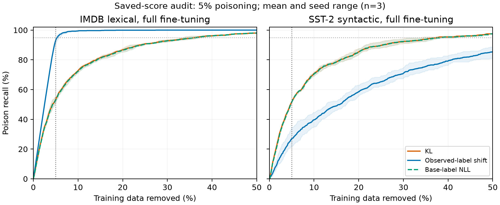

# Deeper audit of detection variation and GSM8K removal

Date: 2026-09-26. This audit reanalyzes all 27 poisoned main-suite runs and
replays GSM8K preprocessing with a pinned tokenizer and checksum-verified public
data. It does **not** report newly trained models or corrected GSM8K efficacy.
Historical aggregate records have not been overwritten.

## 1. The generative experiment needs revalidation

The checked-in historical `rebuttal/run_gsm8k.py` (commit `809ba0b`) has two
independent padding errors. If that script generated the aggregate result, the
experiment did not implement its stated response-boundary detector or
response-only training objective. The result file has no code hash or saved
victim checkpoint, so this is a source-code/data replay, not an exact replay of
the historical execution.

**Readout:** the tokenizer uses left padding, but scoring takes
`attention_mask.sum(1) - 1` as an absolute position. That expression is valid for
right-padded sequences. With left padding, the response-boundary position is
the final nonpadding index. In the original batches of eight, **6,518/7,473
examples (87.2%) select the wrong position**; 1,237 select padding. The median
position error is 36 tokens early. Batch size one has zero indexing errors;
batch size 16 has 93.6%. This creates dependence on neighboring examples'
lengths, before considering model behavior.

**Training:** `labels[:prompt_length] = -100` masks the beginning of the
left-padded array, rather than the prompt at its shifted location. Prompt
tokens remain supervised on all 374 poisoned rows and 7,092/7,099 clean rows.
Across poisoned examples, **94.4% of supervised token positions are prompt
tokens**, compared with 39.1% on clean examples. This changes the objective and
dilutes response supervision differently for short malicious responses and
long math solutions. These are token-count proportions, not measured shares of
loss or gradient magnitude. They do not prove that corrected training will
improve detection, math accuracy, or mitigation.

The original training also does not seed its training RNG and mishandles the
final partial gradient-accumulation group. Thus a single before/after comparison
does not isolate the effect of removal.

The fixes use absolute nonpadding positions, padding-independent position IDs,
offset-based response masks, explicit training seeds, and complete accumulation
groups. Five regression tests include a real, randomly initialized tiny causal
Transformer: its selected logits match for a prompt alone, left-padded, and
right-padded in a mixed-length batch. Corrected masks were checked on all 7,473
GSM8K rows. Corrected runs write `*_padding_v2` outputs, use stable ID-based tie
handling, and preserve per-example scores. These fixes have not been trained
end to end. Historical aggregate results remain evidence of that run's failed
intervention; they do not establish failure of a correctly implemented method.

## 2. The GSM8K removal budget cannot answer the stronger claim

The saved run contains 374 poisons among 7,473 examples but removes only 100:

| Quantity | Value |
|---|---:|
| Removal budget as a share of training data | 1.34% |
| Maximum possible poison recall at this budget | 26.7% |
| Actual recall (7/374) | 1.87% |
| Actual poisons remaining | 367 |
| Actual poison rate after removal | 4.98% |
| Poisons remaining with perfect top-100 detection | 274 |
| Poison rate with perfect top-100 detection | 3.72% |

Randomly removing 100 would remove 5.00 poisons on average. The probability of
removing at least seven by chance is 0.234 under a hypergeometric null. Seven
poisons removed is weak evidence of enrichment. Even a perfect detector at this
budget would leave substantial contamination; whether that residual suffices
to preserve the backdoor requires an oracle-removal experiment.

The repository also has the previously omitted random-removal control:

| Historical condition | ASR | Math accuracy | Poisons removed |
|---|---:|---:|---:|
| Before removal | 93.33% | 19.33% | 0 |
| PD top-100 | 94.00% | 16.33% | 7 |
| Random top-100 | 94.00% | 19.67% | 3 |

Each evaluation uses 300 examples according to the script. The ASR change is
two outputs; the math-accuracy change is nine. Without saved paired outputs and
repeated seeded retraining, these are point estimates, not evidence that
filtering systematically worsens ASR or utility.

There is a provenance conflict: the paper and `revision_results.json` report
AUROC **0.483**, while `rebuttal/results/gsm8k_removal_rate5.json` reports
**0.506091**. The removal counts and rounded before/after outcomes agree.
The former is an author-supplied summary with its own precedence notes; the
latter is a local aggregate. Neither number should silently replace the other
until their run identities are reconciled. The paper's assertion that random
control metrics are unavailable is too broad given the local record above.

## 3. Detection variation has a measurable explanation

For observed label y, the binary score is exactly

`observed_shift = adapted_margin(y) - base_margin(y)`.

Here `margin(y)` is the logit of y minus the other label's logit. Reconstructing
this identity from saved logits succeeds for every poisoned main-suite run.
The table gives the mean of the three per-seed medians at 5% poisoning under
full fine-tuning; it is not the median of a pooled dataset.

| Condition | Base margin: poison / clean | Adapted margin: poison / clean | Shift: poison / clean |
|---|---:|---:|---:|
| IMDB lexical, N=10,000 | -2.79 / 2.86 | 18.29 / 12.04 | 21.00 / 9.24 |
| SST-2 syntactic, N=6,000 | -1.95 / 2.91 | 9.31 / 10.90 | 10.59 / 8.04 |

Lexical poisons combine base disagreement with unusually high adapted confidence.
Both terms help the observed-label shift. Syntactic poisons have weaker adapted
margins than clean examples, reducing separation. Within the observed positive
class, observed-shift AUROC is 0.999 for lexical poisoning but 0.699 for
syntactic poisoning. The difference persists after removing the easy
clean-negative comparison; it is not merely a binary class-mixture artifact.

This remains a descriptive explanation: dataset and attack family change
together. It does not causally isolate syntax, model capacity, or trigger
complexity. A same-dataset lexical-versus-syntactic experiment is required for
that claim.

For KL, the main issue is different. Once the adapted model nearly assigns
probability one to the observed label, label-space KL approaches base-label
NLL. In these full-fine-tuning conditions the KL/base-NLL top-5% sets overlap
**99.0% on IMDB and 97.3% on SST-2**, averaged over seeds. Every clean example
in these KL top-5% sets is an example the base classifier got wrong. Thus KL
spends much of its budget removing ordinary base-model mistakes. Full-vocabulary
KL is not algebraically identical to label KL, but the saved rankings exhibit
the same behavior.

Confidence alone is also inadequate: its previously reported post-hoc F1 is
0.819 on full-fine-tuning IMDB, zero on syntactic poisoning, and about 0.011 on
LoRA IMDB. A claim that all success is explained by confidence would be too
strong. Base disagreement and adapted confidence must be examined together.

## 4. Good AUROC does not imply a sufficiently clean retained dataset

| Full-fine-tuning condition | Score | AUROC | Recall at 5% removal | Poisons left | Observed post-retraining ASR |
|---|---|---:|---:|---:|---:|
| IMDB, 500 poisons | KL | 0.929 | 53.5% | 232.7 | 98.7% |
| IMDB, 500 poisons | Observed shift | 0.998 | 93.0% | 35.0 | 17.0% |
| SST-2, 300 poisons | KL | 0.922 | 51.7% | 145.0 | 48.9% |
| SST-2, 300 poisons | Observed shift | 0.784 | 26.9% | 219.3 | 76.2% |

Counts and outcomes are means across seeds. ASR comes from existing retraining
experiments; it was not inferred from poison counts. There is no universal
mapping from the number of residual poisons to ASR.

Retrospectively reaching 95% poison recall with the saved rankings requires an
average removal budget of 5.32% for IMDB observed shifts, **35.83% for IMDB KL**,
and **37.51% for SST-2 KL**. This uses poison labels diagnostically and is not an
available deployment threshold. It demonstrates that simply moving the KL
cutoff a little cannot clean the tail. At a 10% removal budget, IMDB observed
shifts leave 2–4 poisons, but SST-2 KL still leaves 84–92. Those larger-budget
models have not been retrained, and their clean utility is unknown.



F1 also mixes detection with the budget/prevalence mismatch. At poison fraction
p and removal fraction q, even perfect ranking is capped at
`F1 = 2 min(p,q)/(p+q)`. At 0.5% poisoning and a 5% budget, the ceiling is 0.182,
so the IMDB KL F1 of 0.120 represents 66% recall, not 12% recall. Report
precision, recall, residual contamination, and clean removals alongside F1.

## 5. Experiments that would most improve the paper

1. **Validate generative measurement before claiming efficacy.** Preserve new
   checkpoints, generated outputs, dataset/model revisions, code hashes, and
   training seeds. On the same newly reproduced victim compare historical
   readout with corrected response-boundary readout; then separately compare
   historical and corrected training masks. Changing both at once cannot
   identify which mattered. Historical victim weights were not found locally.
2. **Add sequence-aware scores with controls.** Compare corrected first-token
   KL with mean response-token log-likelihood gain,
   `mean_t[log p_adapt(y_t|x,y_<t) - log p_base(y_t|x,y_<t)]`, and a fixed
   final-answer-window variant. Use only observed response tokens, not the known
   malicious target. Include response length, base response NLL, and adapted
   response NLL: a fixed short attack phrase may be trivially identifiable by
   length. Predefine score directions and windows before new runs. These are
   hypotheses, not validated improvements or sequence-distribution KL.
3. **Test removal budgets and oracle feasibility.** For full GSM8K, compare
   budgets 100, 374, and 748, each with matched random and oracle removal and
   the same retained size and training steps. Add a clean-trained control and
   three seeds. An oracle failure at 100 diagnoses budget/learning limitations;
   oracle success with detector failure diagnoses ranking limitations.
4. **Close the sentiment attribution gap.** Add base-NLL and adapted-confidence
   removal arms under the existing protocol. Evaluate lexical and syntactic
   poisoning on the same dataset/model/schedule before calling the mechanism
   trigger-specific. Adding an attack-specific score selector after seeing
   labels would not demonstrate a deployable improvement.

The stronger paper claim is about **which prediction changes separate poison
learning from ordinary adaptation, and when their rankings leave too much
contamination for remediation**. The present evidence supports that analysis.
It does not yet support a successful generative defense.

## Reproduction and artifacts

From the repository root:

```sh
OMP_NUM_THREADS=2 OPENBLAS_NUM_THREADS=2 python coling2027/deep_audit.py
OMP_NUM_THREADS=2 OPENBLAS_NUM_THREADS=2 python -m rebuttal.audit_gsm8k_padding
python coling2027/plot_deep_audit.py
python -m unittest rebuttal.test_causal_utils -v
```

`score_audit.json` contains per-run distributions, score-file hashes, budget
curves, margin decompositions, and aggregate statistics. `score_tables.md`
reports all nine poisoned settings. `gsm8k_padding_audit.json` records the
pinned tokenizer, data checksum, and preprocessing replay. The plot is also
available as a standalone PDF. Downloading the public tokenizer/data is needed
for the GSM8K preprocessing replay; no model weights are required.

The causal indexing diagnosis agrees with the official
[Transformers generation guidance](https://huggingface.co/docs/transformers/llm_tutorial),
which uses left padding for decoder-only batched generation. The measured
counts and corrected-mask checks above come from local code/data execution.
